# Zusfylri武将包武将图鉴

生成日期：2026-06-04

本图鉴按当前 `module/*.js` 注册内容整理，图片路径使用相对 `docs/` 目录的链接。若后续调整技能、称号或图片，建议同步更新本文件。

## 目录

| 武将 | 称号 | 体力 | 技能 |
| --- | --- | --- | --- |
| [北冥战甲](#北冥战甲) | 破阵子 | 5 | 霸血、玄甲、衝陣 |
| [嫦娥](#嫦娥) | 广寒月皇 | 3 | 月照、蟾镜 |
| [蚩尤](#蚩尤) | 荒古神魔 | 4 | 魔裔、祸源 |
| [丁真](#丁真) | 阅语 | 4 | 知识、学爆 |
| [谢孟伟](#谢孟伟) | 嘎子 | 4 | 酒神、狂宴 |
| [洪秀全](#洪秀全) | 天王 | 4 | 灼掠、均田 |
| [红予](#红予) | 血莲教主 | 3 | 莲蛊、圣葬、异罪 |
| [后羿](#后羿) | 九曜阳帝 | 4 | 九曜、焚世 |
| [姬昌](#姬昌) | 生死易数 | 3/6 | 易数、流转 |
| [景祐](#景祐) | 永祀帝 | 4 | 天赦、续祀 |
| [科比](#科比) | 黄金拳王 | 4 | 肘击 |
| [狼烟](#狼烟) | 北帝 | 2/2 + 1护甲 | 霜漠、孤烟 |
| [李耳](#李耳) | 道德天尊 | 3 | 三清、损补 |
| [马保国](#马保国) | 终极武神 | 3 | 混元 |
| [马克思&孔夫子](#马克思孔夫子) | 无 | 4 | 周礼、风暴 |
| [茉](#茉) | 春瓦绿 | 3 | 九相、星演、还虚 |
| [柠姬](#柠姬) | 原型机 | 3 | 弦启、余韵 |
| [青](#青) | 帐中妖 | 3 | 夜谏、熏权 |
| [山上彻也](#山上彻也) | 最后的英灵 | 4 | 萤焰、绝赴 |
| [司马懿](#司马懿) | 与世争 | 3/4 | 尘劳、望空 |
| [薇](#薇) | 吹落血 | 3 | 长歌、誓约 |
| [吴京](#吴京) | 战狼 | 4 | 引雷、漂移、雷劫 |
| [相青](#相青) | 寂灭佛 | 5 | 虚果、空花、寂灭 |
| [嬴政](#嬴政) | 始皇帝 | 4 | 销镝、夷灭、皇道 |
| [鸢后](#鸢后) | 幽羽噬心 | 1/6 | 夺元、裂魄 |
| [赵云](#赵云) | 苍天龙魂 | 4 | 绝啸、孤胆 |
| [庄周](#庄周) | 齐物逍遥 | 3 | 梦蝶、真态技能、幻态技能 |
| [祝黎](#祝黎) | 南王 | 4 | 镇兽、御荒、裂劲 |
| [朱鸾](#朱鸾) | 西皇 | 3 | 皇仪、凤诏 |
| [花晓峰](#花晓峰) | 诉与孤风 | 4 | 乘苍、听霜 |

## 北冥战甲

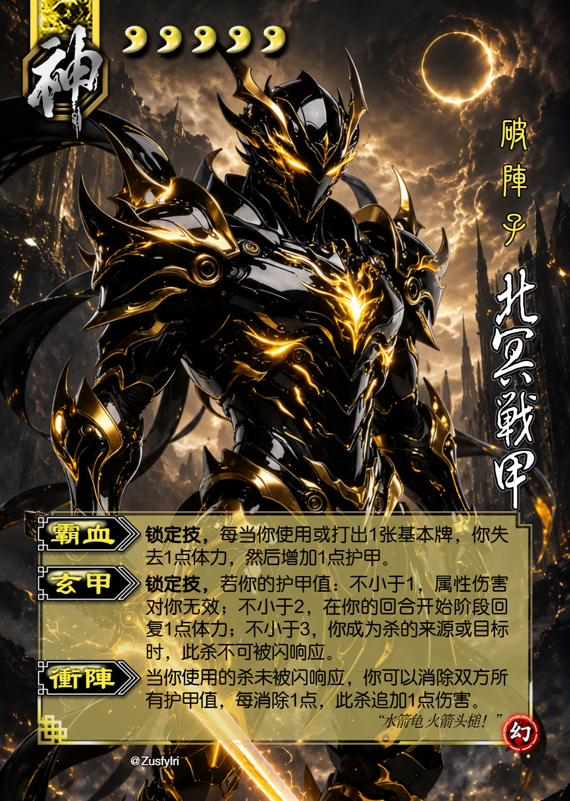

- 称号：破阵子
- 体力：5
- 霸血：锁定技，每当你使用或打出1张基本牌，你失去1点体力，然后增加1点护甲。
- 玄甲：锁定技，若你的护甲值：不小于1，属性伤害对你无效；不小于2，在你的回合开始阶段回复1点体力；不小于3，你成为【杀】的来源或目标时，此【杀】不可被【闪】响应。
- 衝陣：当你使用的【杀】未被【闪】响应，你可以消除双方所有护甲值，每消除1点，此【杀】追加1点伤害。

## 嫦娥

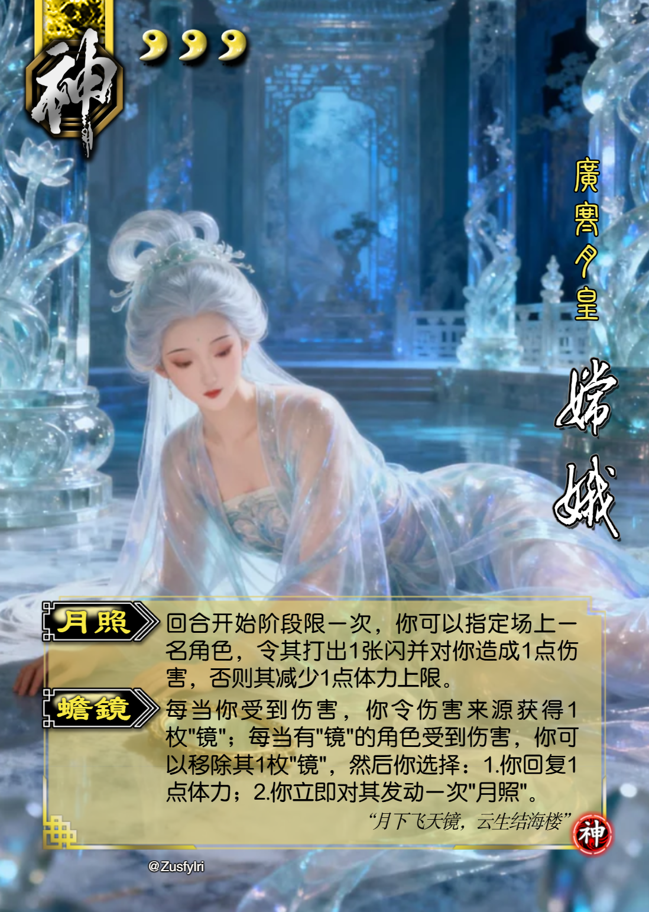

- 称号：广寒月皇
- 体力：3
- 月照：回合开始阶段限一次，你可以指定场上一名角色，令其打出1张【闪】并对你造成1点伤害，否则其减少1点体力上限。
- 蟾镜：每当你受到伤害，你令伤害来源获得1枚“镜”；每当有“镜”的角色受到伤害，你可以移除其1枚“镜”，然后你选择：1.你回复1点体力；2.你立即对其发动一次【月照】。

## 蚩尤

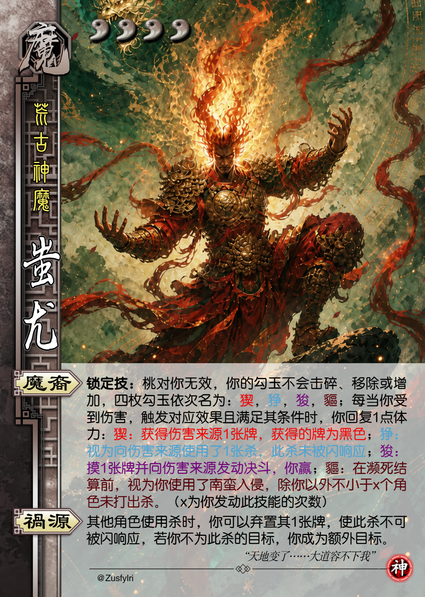

- 称号：荒古神魔
- 体力：4
- 魔裔：锁定技，桃对你无效，你的体力上限不会增加、减少或被击碎；四枚勾玉依次固定名为“猰”“狰”“狻”“貙”。当你受到伤害并失去对应勾玉时，触发其效果：猰：获得伤害来源1张牌，若获得的牌为黑色，你回复1点体力；狰：视为对伤害来源使用1张【杀】，若此【杀】未被【闪】响应，你回复1点体力；狻：摸1张牌并视为对伤害来源使用1张【决斗】，若你赢，你回复1点体力。濒死结算前，你触发“貙”，视为使用【南蛮入侵】，若除你以外不小于X名角色未打出【杀】，你回复1点体力（X为你发动此技能的次数）。
- 祸源：其他角色使用【杀】时，你可以弃置其1张牌，使此【杀】不可被【闪】响应，若你不为此【杀】的目标，你成为额外目标。

## 丁真

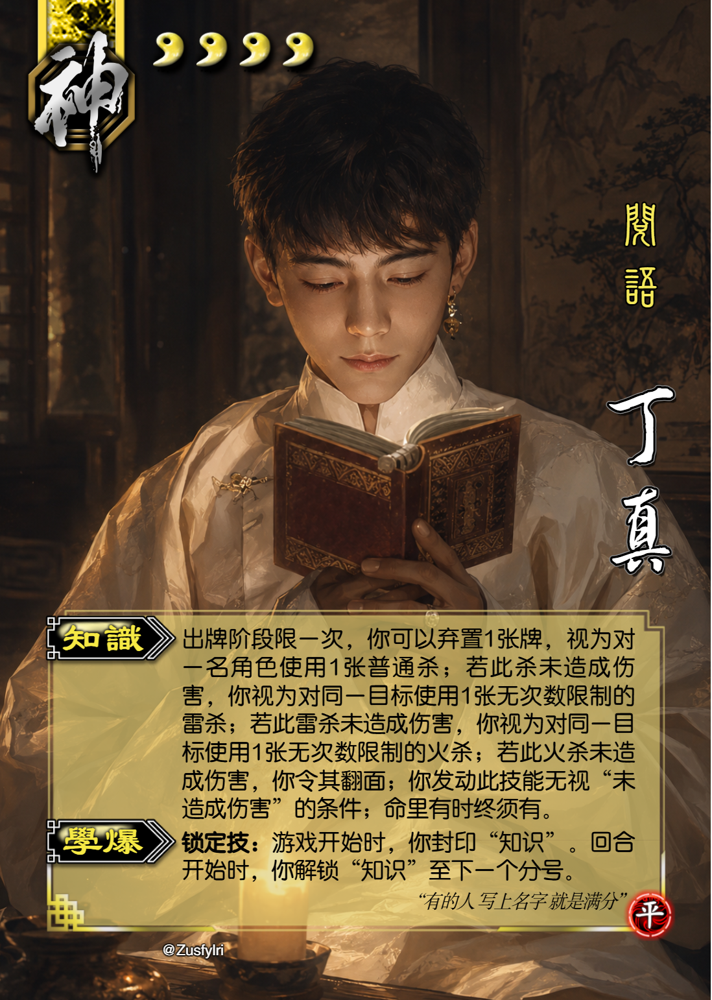

- 称号：阅语
- 体力：4
- 知识：出牌阶段限一次，你可以弃置1张牌，视为对一名角色使用1张普通【杀】；若此【杀】未造成体力伤害，你视为对同一目标使用1张无次数限制的雷【杀】；若此雷【杀】未造成体力伤害，你视为对同一目标使用1张无次数限制的火【杀】；若此火【杀】未造成体力伤害，你令其翻面；当你发动此技能至第五段时，无视“未造成体力伤害”的条件。命里有时终须有。
- 学爆：锁定技，游戏开始时，你封印【知识】。回合开始时，你解锁【知识】至下一个分号。

## 谢孟伟

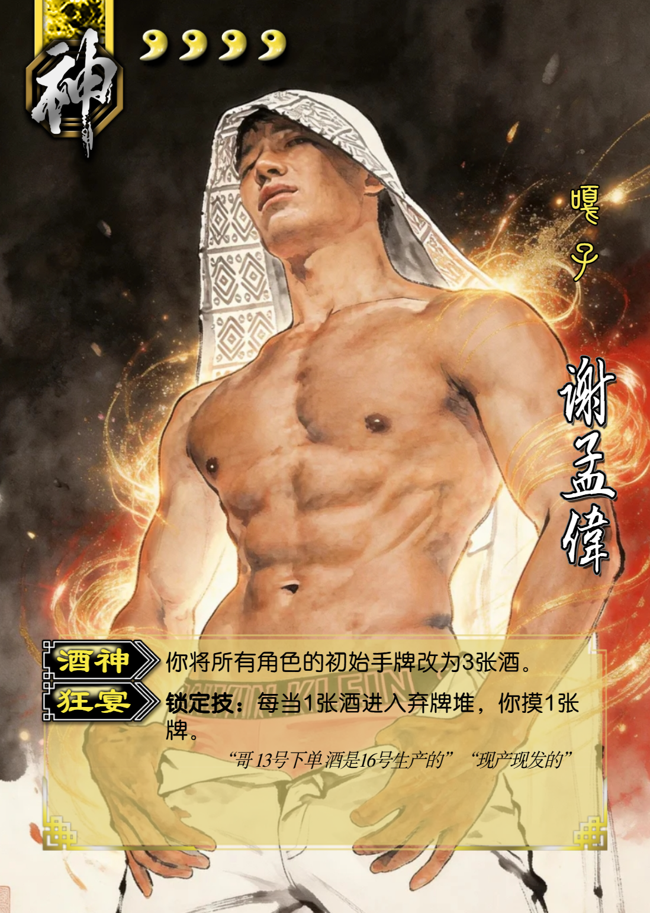

- 称号：嘎子
- 体力：4
- 酒神：游戏开始时，你将所有角色的初始手牌改为3张【酒】。
- 狂宴：锁定技，每当一张【酒】进入弃牌堆，你摸一张牌。

## 洪秀全

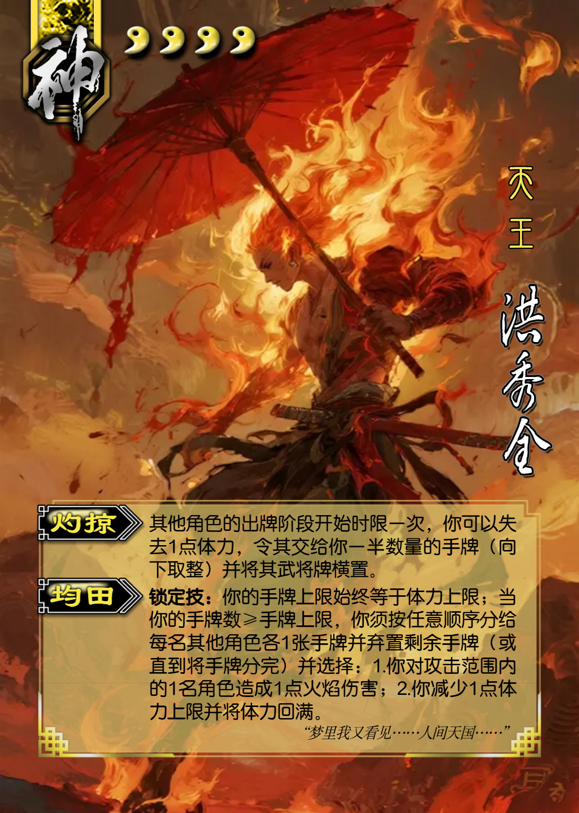

- 称号：天王
- 体力：4
- 灼掠：其他角色的出牌阶段开始时限一次，你可以失去1点体力，令其交给你一半数量的手牌（向下取整），并将其武将牌横置。
- 均田：锁定技，你的手牌上限始终等于体力上限。当你的手牌数不小于手牌上限时，你须按任意顺序分给每名其他角色各1张手牌并弃置剩余手牌（或直到将手牌分完），然后选择一项：1. 对攻击范围内的一名角色造成1点火焰伤害；2. 减少1点体力上限并将体力回复至上限。

## 红予

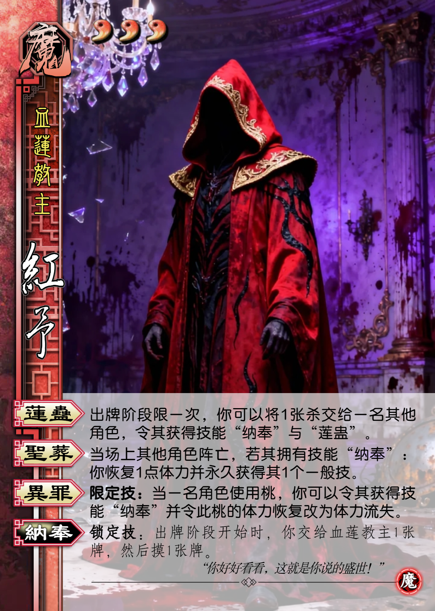

- 称号：血莲教主
- 体力：3
- 莲蛊：出牌阶段限一次，你可以将1张【杀】交给一名其他角色，令其获得技能【纳奉】与【莲蛊】。
- 圣葬：当场上其他角色阵亡，若其拥有技能【纳奉】，你恢复1点体力并永久获得其1个一般技。
- 异罪：限定技，当一名角色使用【桃】，你可以令其获得技能【纳奉】，并令此【桃】的体力回复改为体力流失。

## 后羿

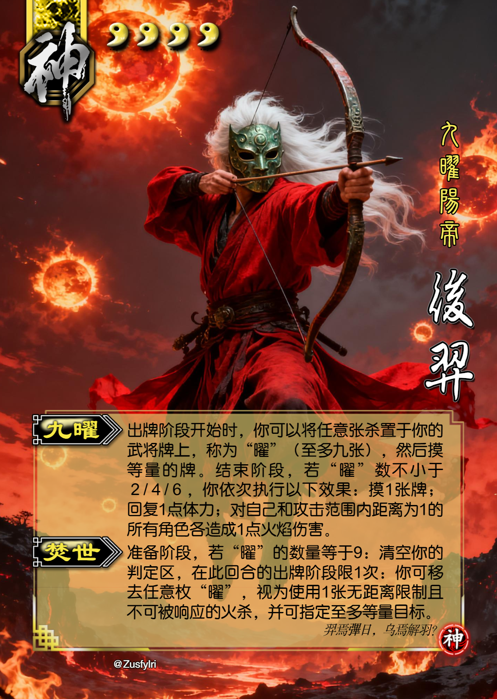

- 称号：九曜阳帝
- 体力：4
- 九曜：出牌阶段开始时，你可以将任意张【杀】置于你的武将牌上，称为“曜”（至多九张），然后摸等量的牌。结束阶段，若“曜”数不小于2/4/6，你依次执行以下效果：摸一张牌；回复1点体力；对自己和攻击范围内的所有角色各造成1点火焰伤害。
- 焚世：准备阶段，若“曜”的数量等于9，你清空你的判定区。此回合出牌阶段限一次，你可以移去任意枚“曜”，视为使用一张无距离限制且不可被响应的火【杀】，并可指定至多等量目标。

## 姬昌

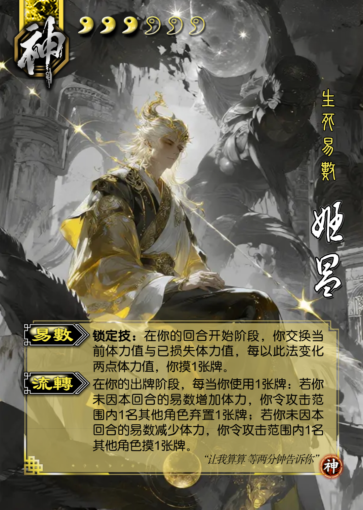

- 称号：生死易数
- 体力：3/6
- 易数：锁定技，在你的回合开始阶段，你交换当前体力值与已损失体力值，每以此法变化两点体力值，你摸1张牌。
- 流转：在你的出牌阶段，每当你使用1张牌：若你未因本回合的【易数】增加体力，你令攻击范围内1名其他角色弃置1张牌；若你未因本回合的【易数】减少体力，你令攻击范围内1名其他角色摸1张牌。

## 景祐

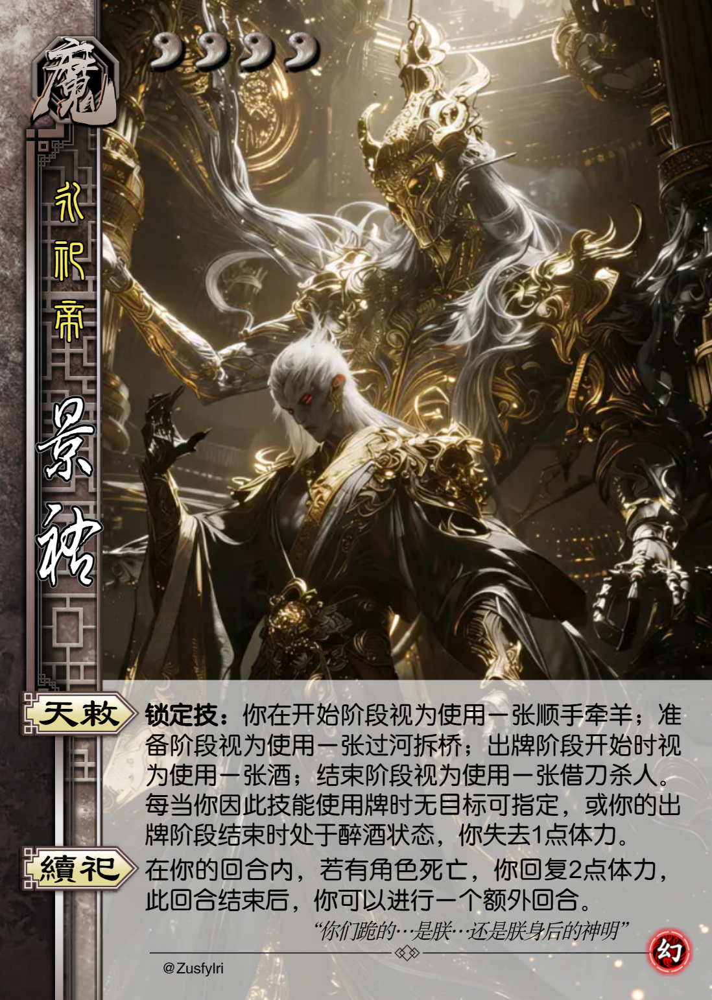

- 称号：永祀帝
- 体力：4
- 天赦：锁定技。你在开始阶段视为使用一张【顺手牵羊】；准备阶段视为使用一张【过河拆桥】；出牌阶段开始时视为使用一张【酒】；结束阶段视为使用一张【借刀杀人】。每当你因此技能使用牌时无目标可指定，或你的出牌阶段结束时处于醉酒状态，你失去1点体力。
- 续祀：在你的回合内，若有角色死亡，你回复2点体力，此回合结束后，你可以进行一个额外回合。

## 科比

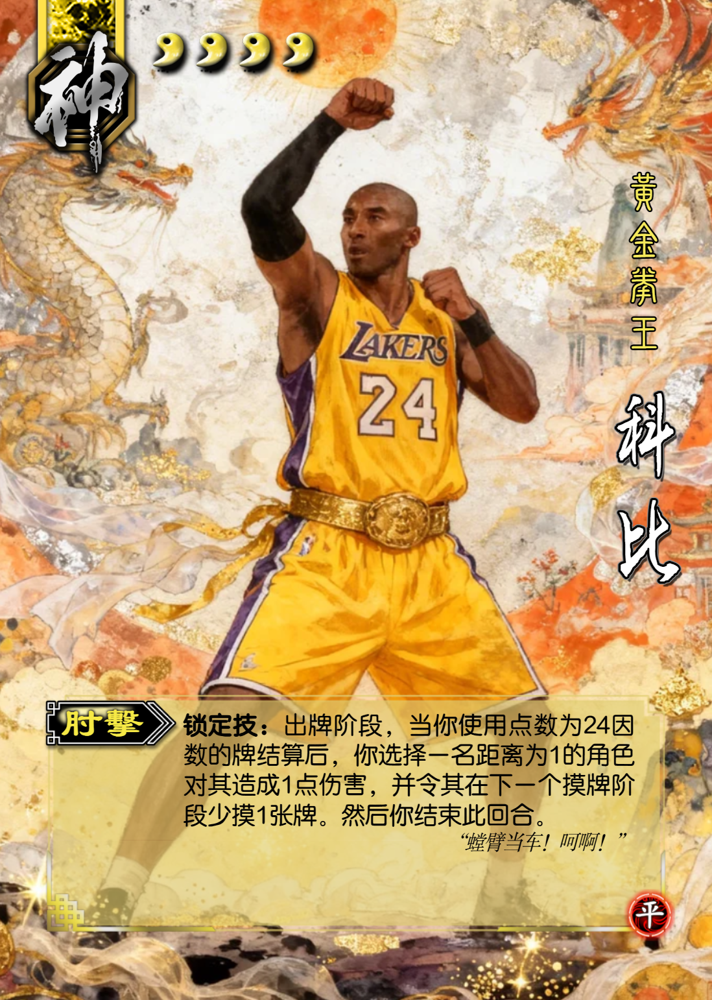

- 称号：黄金拳王
- 体力：4
- 肘击：锁定技，出牌阶段，当你使用点数为24因数的牌结算后，你选择一名距离为1的其他角色，对其造成1点伤害，并令其下一个摸牌阶段少摸一张牌，然后你结束此回合。

## 狼烟

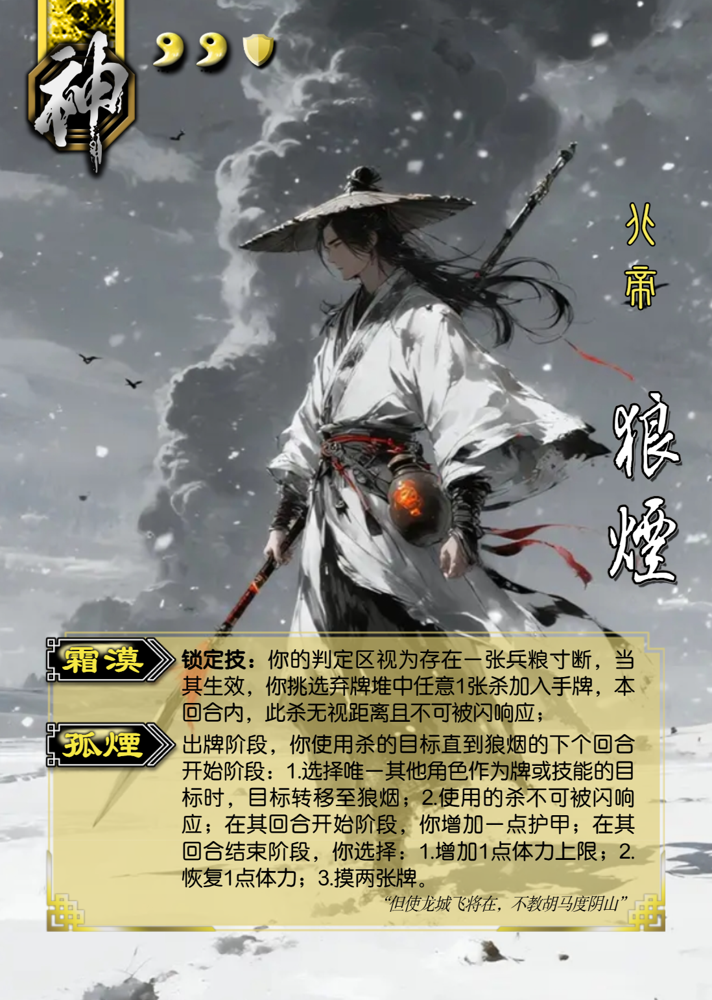

- 称号：北帝
- 体力：2/2，初始护甲：1
- 霜漠：锁定技，你的判定区视为存在一张【兵粮寸断】。当其生效后，你挑选弃牌堆中任意一张【杀】加入手牌，本回合内，此【杀】无视距离且不可被【闪】响应。
- 孤烟：出牌阶段，你使用【杀】指定目标后，直到你的下个回合开始阶段：其使用的【杀】不可被【闪】响应；其回合开始阶段，你增加1点护甲；其回合结束阶段，你选择一项：增加1点体力上限、恢复1点体力、摸两张牌。其选择唯一其他角色为牌或技能的目标时，若你是合法目标，则目标转移至你；否则此牌对原目标无效。

## 李耳

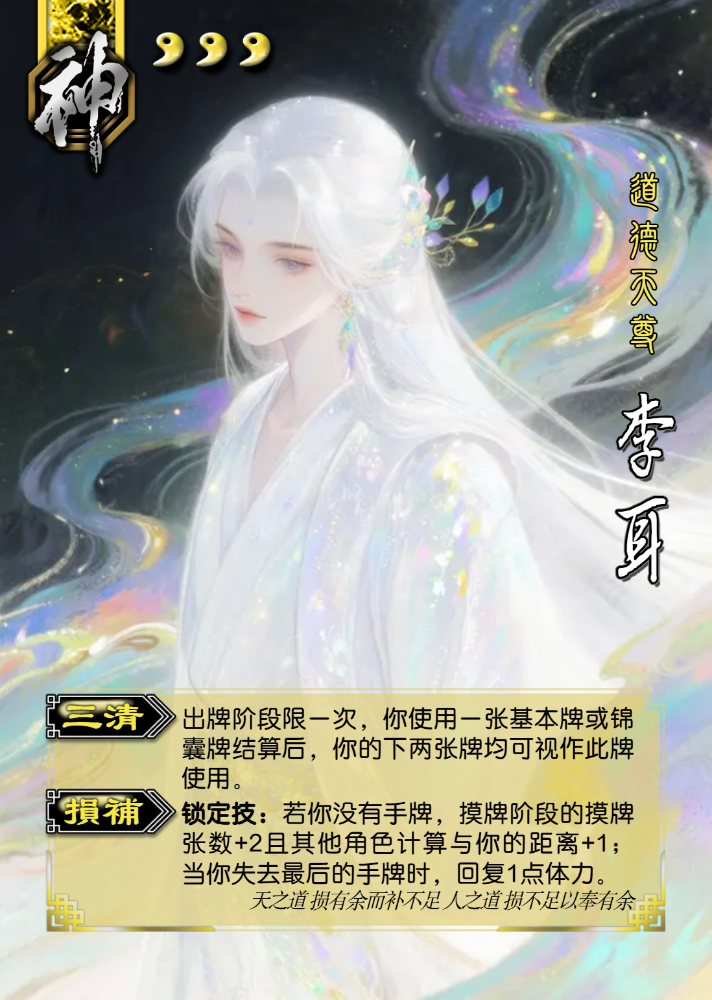

- 称号：道德天尊
- 体力：3
- 三清：出牌阶段限一次，你使用一张基本牌或锦囊牌结算后，可以记录此牌牌名。若如此做，你的下两张牌均可视作此牌使用。
- 损补：锁定技，若你没有手牌，摸牌阶段的摸牌数+2且其他角色计算与你的距离+1；当你失去最后的手牌时，你回复1点体力。

## 马保国

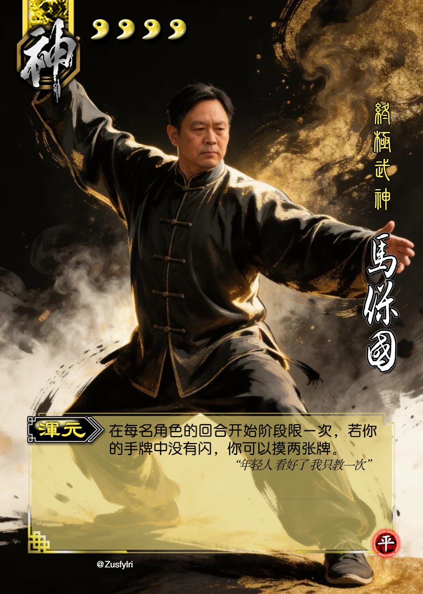

- 称号：终极武神
- 体力：3
- 混元：其他角色的回合开始时，若你的手牌中没有【闪】，你可以摸两张牌。

## 马克思&孔夫子

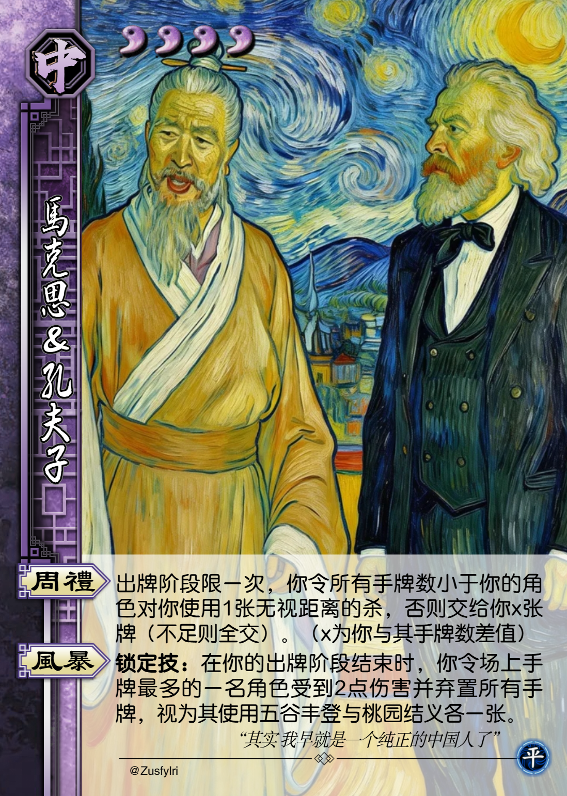

- 称号：无
- 体力：4
- 周礼：出牌阶段限一次，你令所有手牌数小于你的角色对你使用1张无视距离的【杀】，否则交给你X张牌（不足则全交）。X为你与其手牌数差值。
- 风暴：锁定技，在你的出牌阶段结束时，你令场上手牌最多的一名角色受到2点伤害并弃置所有手牌，视为其使用【五谷丰登】与【桃园结义】各一张。

## 茉

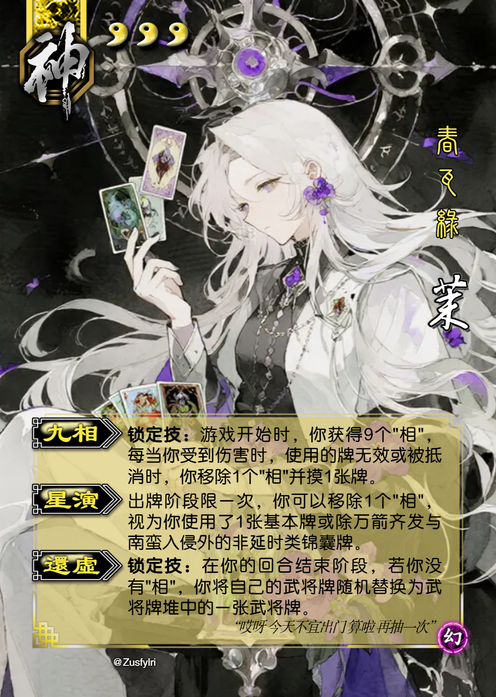

- 称号：春瓦绿
- 体力：3
- 九相：锁定技，游戏开始时，你获得9个“相”。每当你受到伤害时，或你使用的牌无效、被抵消，或其造成的伤害被防止时，你移除1个“相”并摸1张牌。
- 星演：出牌阶段限一次，你可以移除1个“相”，视为使用一张基本牌或除【万箭齐发】与【南蛮入侵】外的非延时锦囊牌。
- 还虚：锁定技，回合结束阶段，若你没有“相”，你随机替换武将牌。

## 柠姬

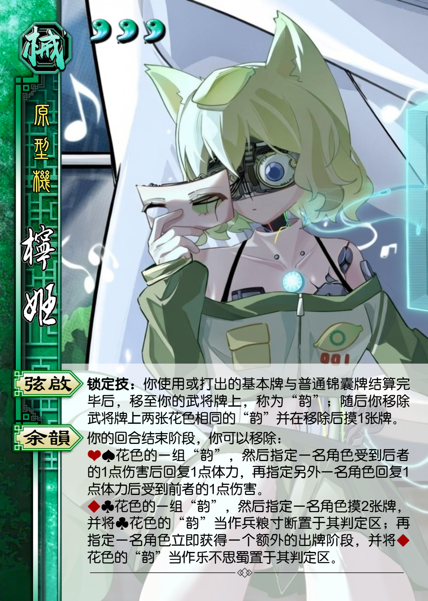

- 称号：原型机
- 体力：3
- 弦启：锁定技，你使用或打出的基本牌与普通锦囊牌结算完毕后，移至你的武将牌上，称为“韵”；随后你移除武将牌上两张花色相同的“韵”并在移除后摸1张牌。
- 余韵：你的回合结束阶段，你可以移除：♥♠花色的一组“韵”，然后指定一名角色受到后者的1点伤害后回复1点体力，再指定另外一名角色回复1点体力后受到前者的1点伤害；♦♣花色的一组“韵”，然后指定一名角色摸2张牌，并将♣花色的“韵”当作【兵粮寸断】置于其判定区；再指定一名角色，立即获得一个额外的出牌阶段，并将♦花色的“韵”当作【乐不思蜀】置于其判定区。

## 青

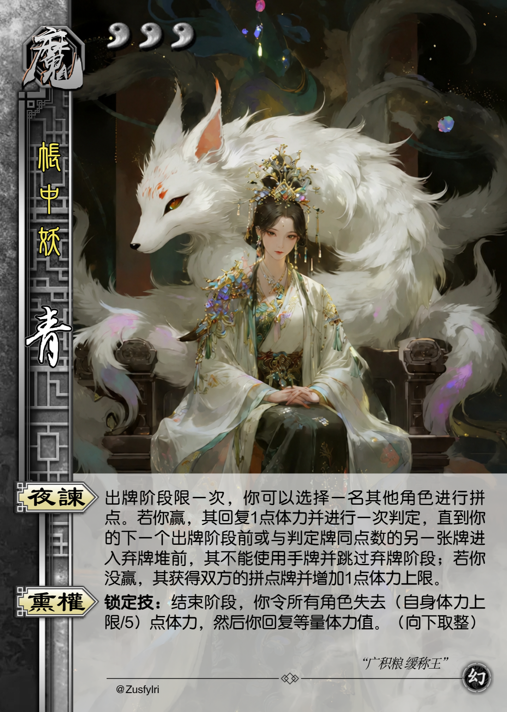

- 称号：帐中妖
- 体力：3
- 夜谏：出牌阶段限一次，你可以选择一名其他角色进行拼点。若你赢，其回复1点体力并进行一次判定，直到你的下一个出牌阶段前，若没有与判定牌同点数的另一张牌进入弃牌堆，则其不能使用手牌并跳过弃牌阶段；若你没赢，其获得双方的拼点牌并增加1点体力上限。
- 熏权：锁定技。结束阶段，你令所有角色失去（自身体力上限/5）点体力，然后你回复等量体力值。（向下取整）

## 山上彻也

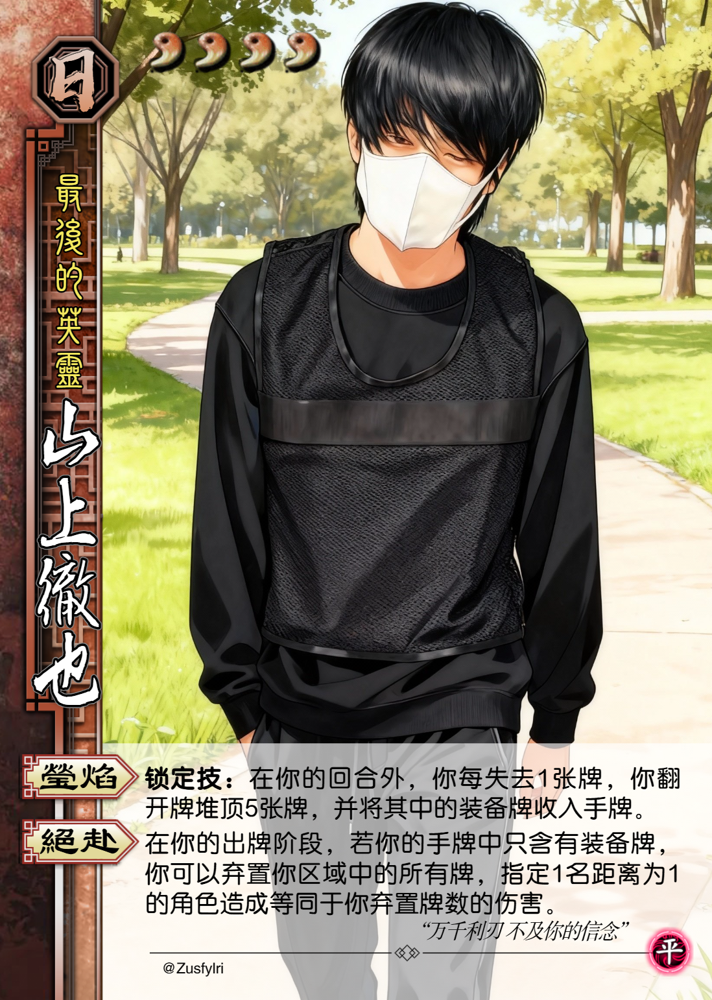

- 称号：最后的英灵
- 体力：4
- 萤焰：在你的回合外，你每失去1张你区域内的牌，你可以翻开牌堆顶5张牌，将其中的装备牌收入手牌，然后将剩余牌置入弃牌堆。
- 绝赴：在你的出牌阶段，当你的手牌中只含有装备牌，你可以弃置你区域中的所有牌，指定1名距离为1的角色造成等同于你弃置牌数的伤害。

## 司马懿

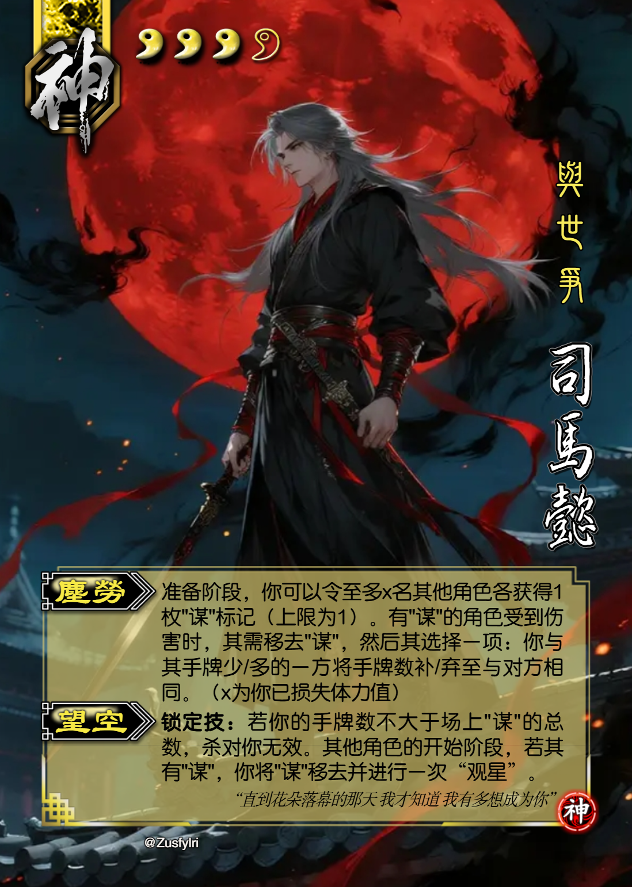

- 称号：与世争
- 体力：3/4
- 尘劳：准备阶段，若你的体力值不为满，你可以令至多X名其他角色各获得1枚“谋”标记（每名角色至多拥有1枚）。“有谋”的角色受到伤害后，其移去1枚“谋”，然后其选择一项：手牌少的一方将手牌数补至与对方相同；或手牌多的一方将手牌弃至与对方相同。（X为你已损失的体力值）
- 望空：锁定技：若你的手牌数不大于场上“谋”的总数，【杀】对你无效。其他角色的开始阶段，若其有“谋”，你移去其1枚“谋”，然后进行一次“观星”。

## 薇

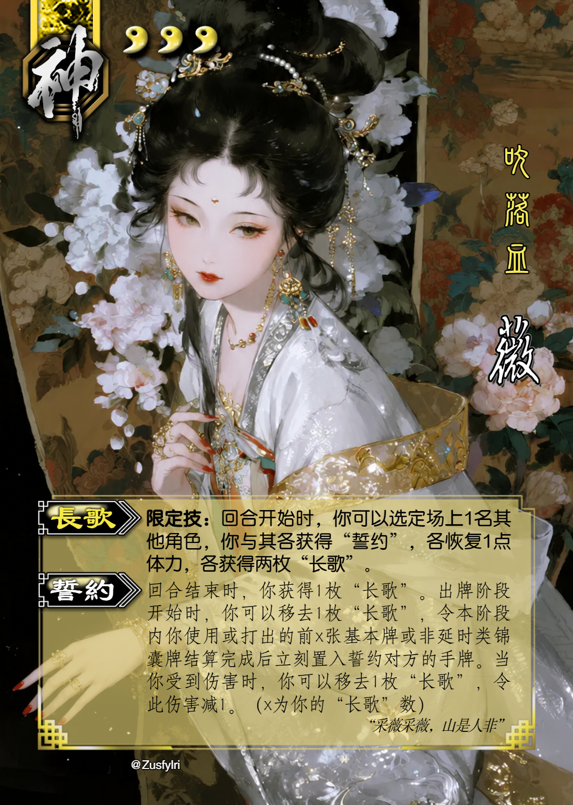

- 称号：吹落血
- 体力：3
- 长歌：限定技。回合开始时，你可以选择场上1名其他角色，你与其各获得“誓约”，各恢复1点体力，各获得两枚“长歌”。
- 誓约：回合结束时，你获得1枚“长歌”。出牌阶段开始时，你可以移去1枚“长歌”，令本阶段内你使用或打出的前X张基本牌或非延时类锦囊牌结算完成后立即置入誓约对方的手牌。当你受到伤害时，你可以移去1枚“长歌”，令此伤害-1。（X为你的“长歌”数）

## 吴京

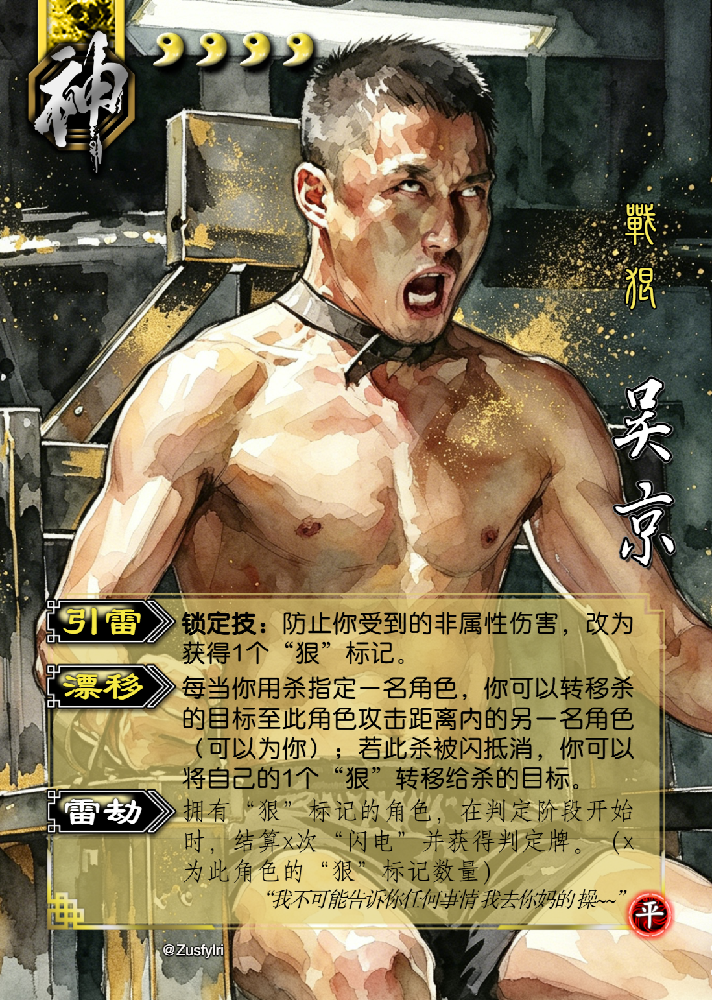

- 称号：战狼
- 体力：4
- 引雷：锁定技：防止你受到的非属性伤害，改为获得1个“狼”标记。
- 漂移：每当你使用【杀】指定一名角色，你可以转移【杀】的目标至此角色攻击距离内的另一名角色（可以为你）；若此【杀】被【闪】抵消，你可以将自己的1个“狼”标记转移给杀的目标。
- 雷劫：拥有“狼”标记的角色，在判定阶段开始时，结算X次【闪电】并获得判定牌。（X为此角色的“狼”标记数量）

## 相青

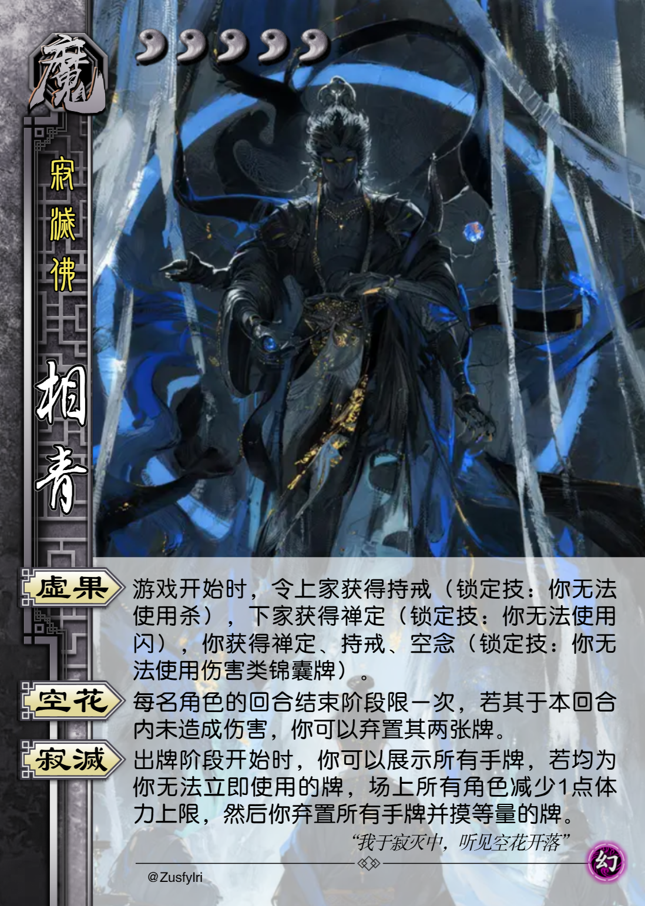

- 称号：寂灭佛
- 体力：5
- 虚果：锁定技，游戏开始时，上家获得“持戒”，下家获得“禅定”，你获得“持戒”“禅定”“空念”。
- 空花：每名角色的回合结束阶段限一次，若其于本回合内未造成伤害，你可以弃置其两张牌。
- 寂灭：出牌阶段开始时，你可以展示所有手牌，若均为你无法立即使用的牌，场上所有角色减少1点体力上限，然后你弃置所有手牌并摸等量的牌。

## 嬴政

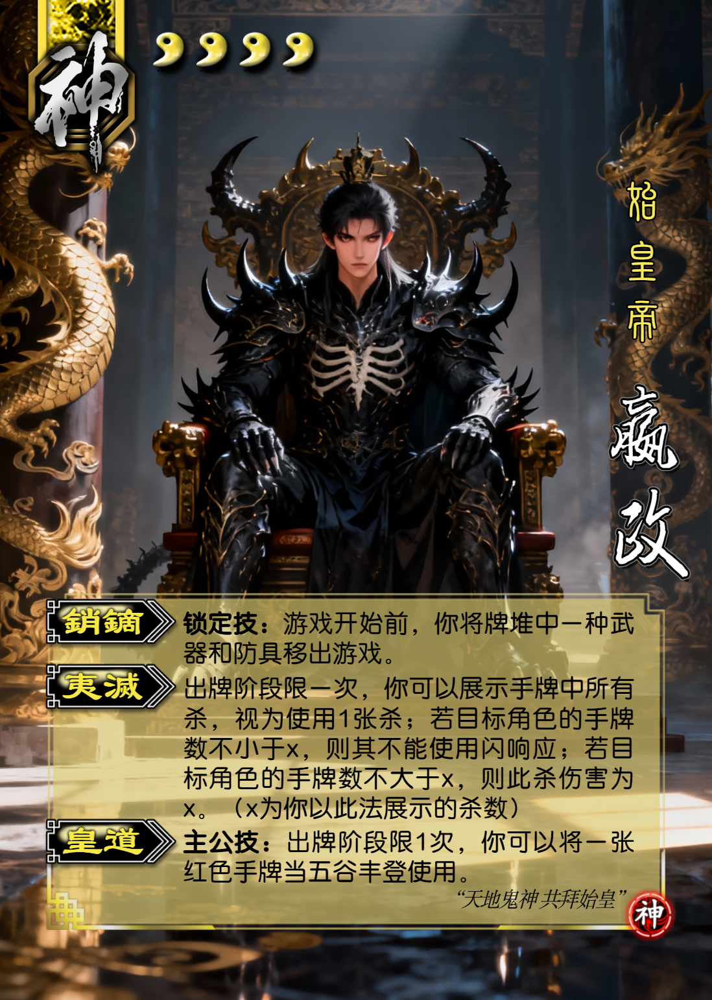

- 称号：始皇帝
- 体力：4
- 销镝：锁定技，游戏开始时，你选择一种武器牌和一种防具牌，将牌堆中同名牌移出游戏；若这些牌已在角色手牌或扩展区内，则将其移出游戏并用牌堆中的其他牌替换。
- 夷灭：出牌阶段限一次，你可以展示手牌中所有【杀】，视为使用一张【杀】；若目标角色的手牌数不小于X，则其不能使用【闪】响应；若目标角色的手牌数不大于X，则此【杀】伤害为X（X为你以此法展示的【杀】数）。
- 皇道：主公技，出牌阶段限一次，你可以将一张红色手牌当【五谷丰登】使用。

## 鸢后

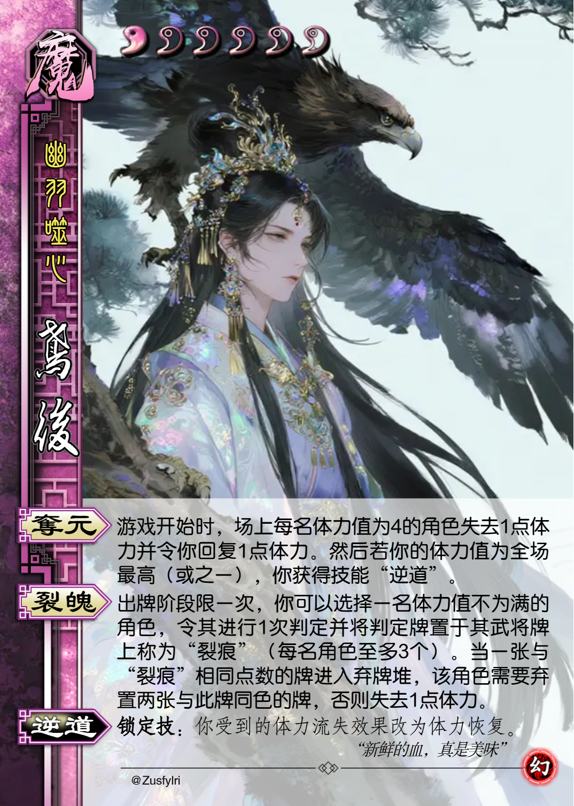

- 称号：幽羽噬心
- 体力：1/6
- 夺元：游戏开始时，场上每名体力值为4的角色失去1点体力并令你回复1点体力。然后若你的体力值为全场最高（或之一），你获得技能“逆道”。
- 裂魄：出牌阶段限一次，你可以选择一名体力值不为满的角色，令其进行1次判定并获得1个点数与判定牌相同的“裂痕”标记（每名角色至多3个）。当一张与其“裂痕”相同点数的牌进入弃牌堆，该角色需要弃置两张与此牌同色的牌，否则失去1点体力。

## 赵云

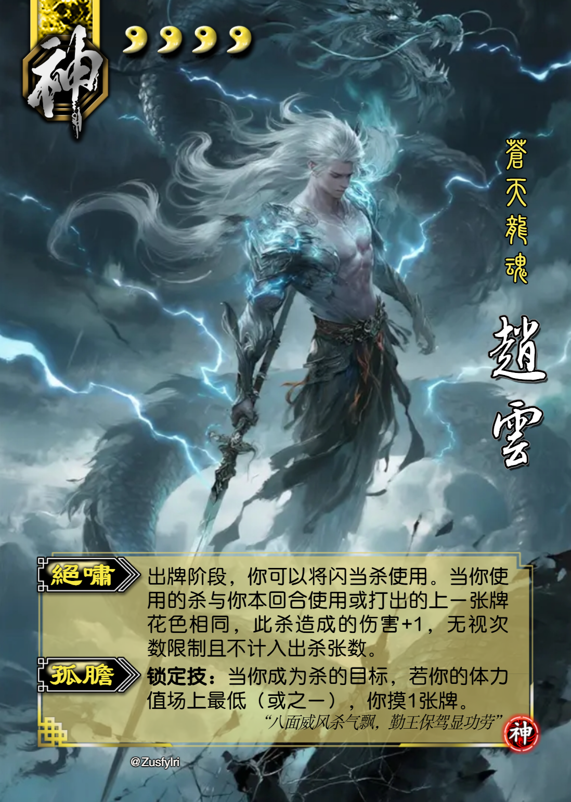

- 称号：苍天龙魂
- 体力：4
- 绝啸：出牌阶段，你可以将【闪】当【杀】使用。当你使用的【杀】与你本回合使用或打出的上一张牌花色相同，此【杀】造成的伤害+1，无视次数限制且不计入出【杀】张数。
- 孤胆：锁定技，当你成为【杀】的目标时，若你的体力值为全场最低（或之一），你摸一张牌。

## 庄周

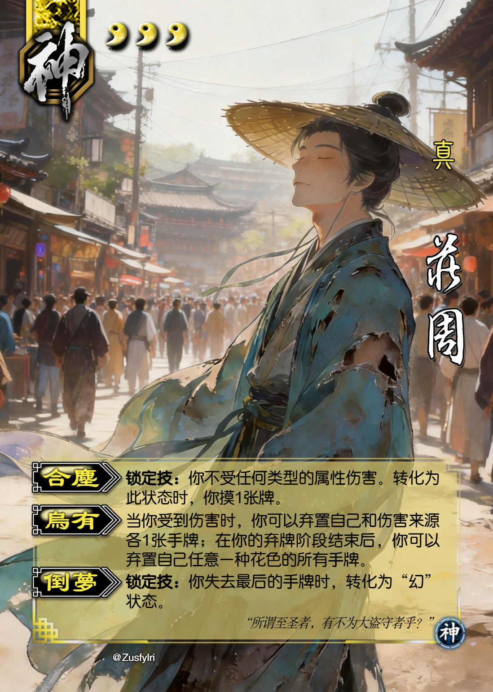
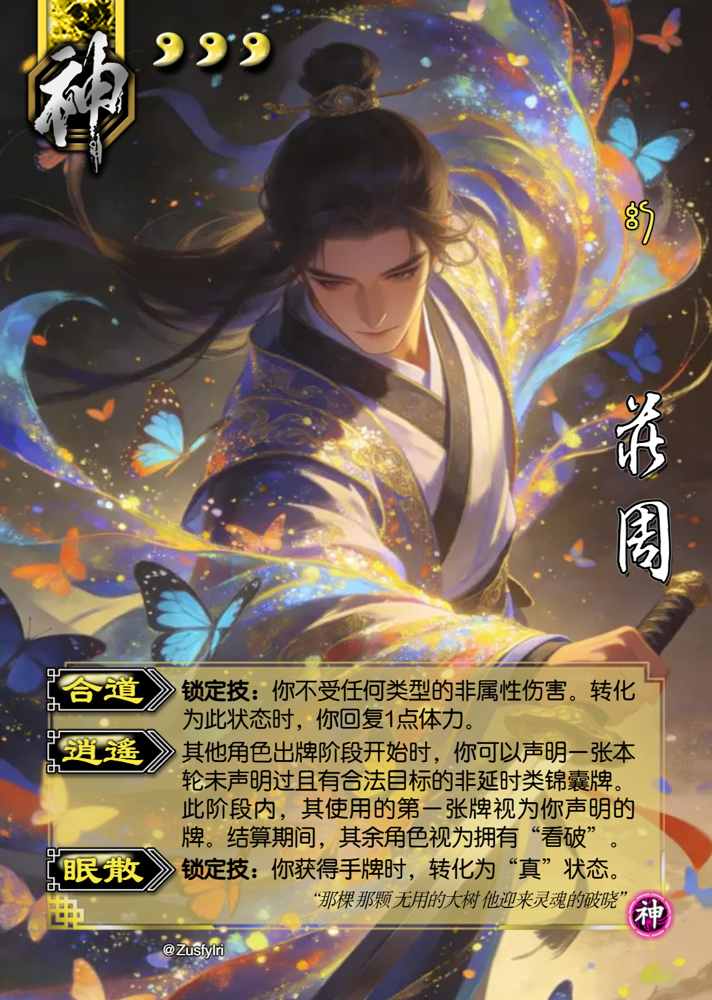

- 称号：齐物逍遥
- 体力：3
- 梦蝶：锁定技，游戏开始时，你为“真”状态；你的形态改变时刷新当前形态的技能与武将牌图片。
- 真态·合尘：锁定技，你不受任何类型的属性伤害。转化为此状态时，你摸1张牌。
- 真态·乌有：当你受到伤害时，你可以弃置自己和伤害来源各1张手牌；在你的弃牌阶段结束后，你可以弃置自己任意一种花色的所有手牌。
- 真态·倒梦：锁定技，你失去最后的手牌时，转化为“幻”状态。
- 幻态·合道：锁定技，你不受任何类型的非属性伤害。转化为此状态时，清除“逍遥”的声明记录。
- 幻态·逍遥：每名其他角色的出牌阶段开始时，你可以声明一张你未声明过且有合法目标的非延时类锦囊牌，此阶段内，其使用的第一张牌视为你声明的牌，此牌结算期间，其余角色视为拥有“看破”。
- 幻态·眠散：锁定技，你获得手牌时，转化为“真”状态。

## 祝黎

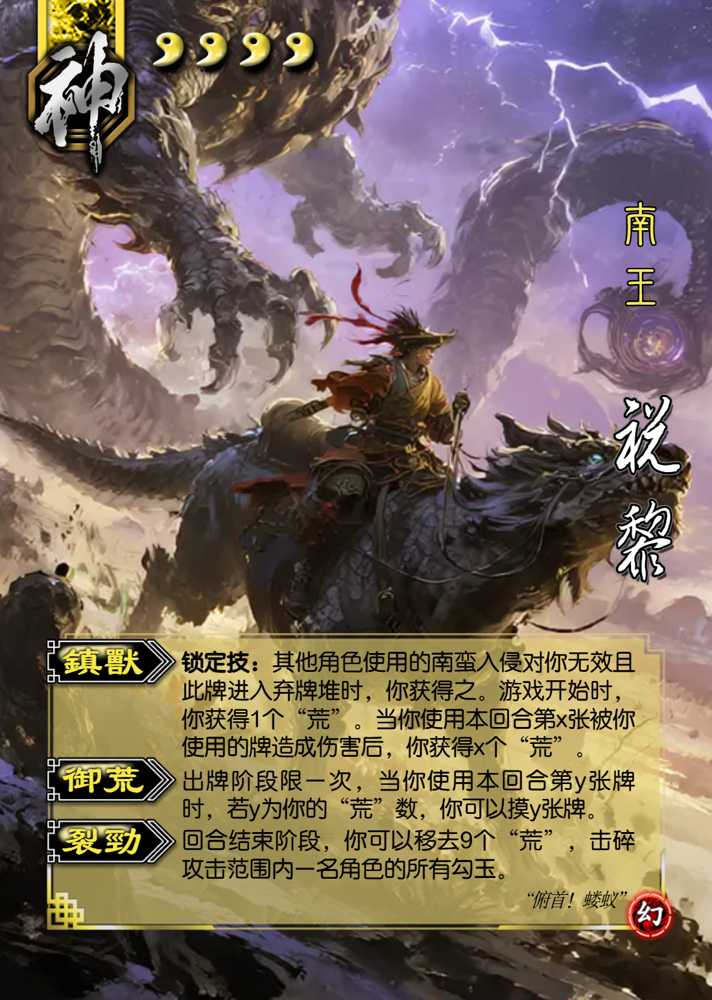

- 称号：南王
- 体力：4
- 镇兽：锁定技，其他角色使用的【南蛮入侵】对你无效，且此牌进入弃牌堆时，你获得之。游戏开始时，你获得1个“荒”。当你使用本回合第X张牌造成伤害后，你获得X个“荒”。
- 御荒：出牌阶段限一次，当你使用本回合第Y张牌时，若Y为你的“荒”数，你可以摸Y张牌。
- 裂劲：回合结束阶段，你可以移去9个“荒”，击碎攻击范围内一名角色的所有勾玉。

## 朱鸾

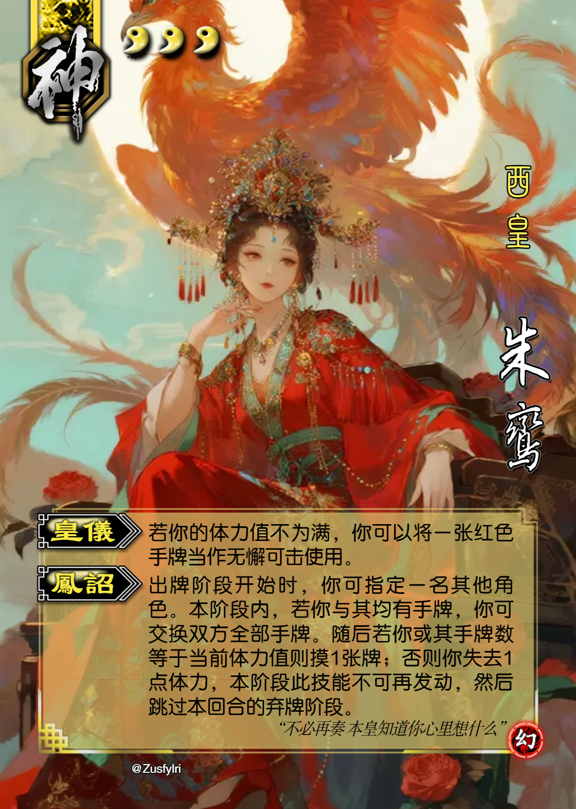

- 称号：西皇
- 体力：3
- 皇仪：若你的体力值不为满，你视为拥有【皇仪·无懈】；你可以将一张红色手牌当【无懈可击】使用或打出。
- 凤诏：出牌阶段开始时，你可以指定一名其他角色。本阶段内，若你与其均有手牌，你可以与其交换全部手牌。然后，你与其中手牌数等于各自体力值的角色各摸1张牌；若双方均不满足，则你失去1点体力，本阶段此技能不可再发动，然后跳过本回合的弃牌阶段。

## 花晓峰

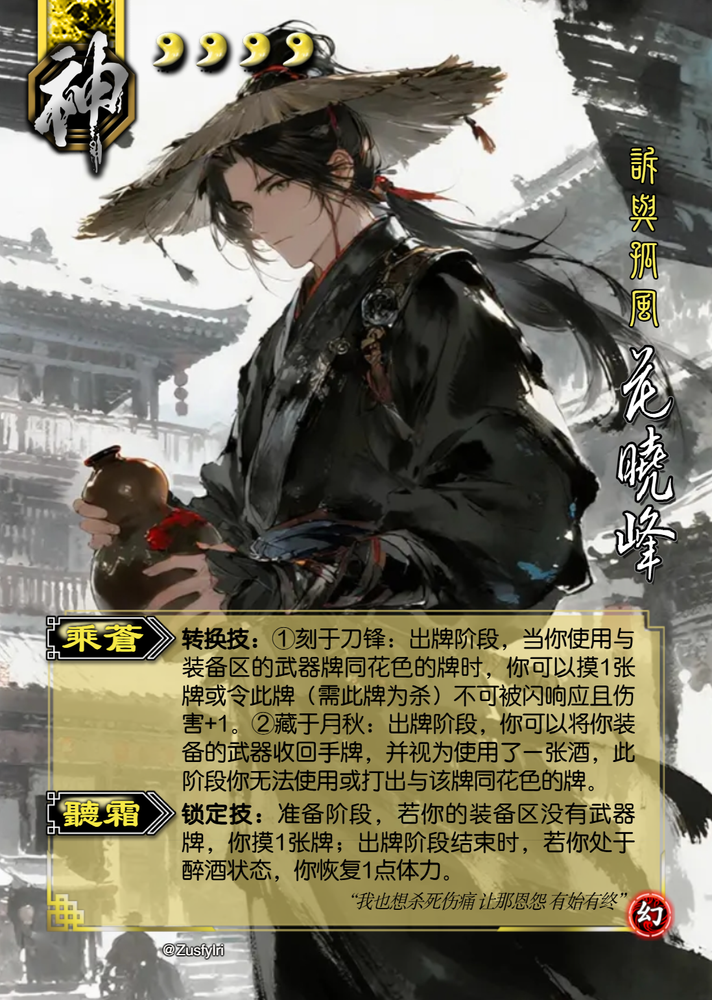

- 称号：诉与孤风
- 体力：4
- 乘苍：转换技。①刻于刀锋：出牌阶段，当你使用与装备区的武器牌花色相同的牌时，你可以摸1张牌，或令此牌（需为【杀】）不可被【闪】响应且伤害+1。②藏于月秋：出牌阶段，你可以将你装备的武器牌收回手牌，并视为使用一张【酒】；此阶段你无法使用或打出与以此法收回的牌花色相同的牌。
- 听霜：锁定技。准备阶段，若你的装备区没有武器牌，你摸1张牌；出牌阶段结束时，若你处于醉酒状态，你恢复1点体力。
